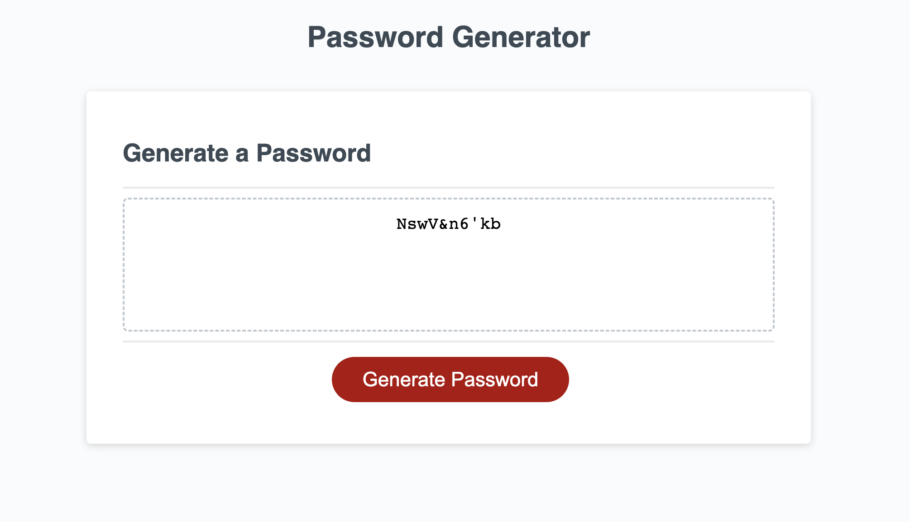

# hw3-passwordgen

## Description

This project generates a random password that is derived from Javascript functions.

## Table of Contents

- [Installation](#installation)
- [Usage](#usage)
- [Credits](#credits)
- [License](#license)

## Installation

No installations are required for this project.

## Usage

To get the application running, click on the deployment link and then click 'Generate Password'

Deployment link: https://laurenmiller389.github.io/hw3-passwordgen/

## Credits

Columbia University Coding Bootcamp

## License

MIT License

## How to Contribute

Keep tabs on the [Contributor Covenant](https://www.contributor-covenant.org/)!

